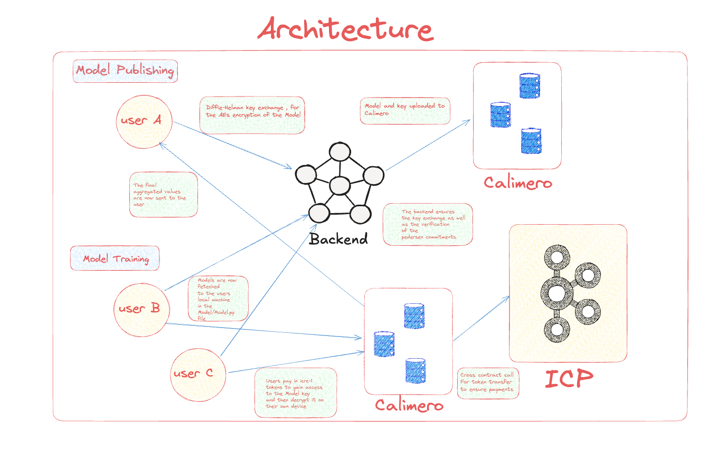

# CaliFusion

 

<b>Your Data, Your Control</b> 
<b>Collective Intelligence, Powered by ICP and Calimero.</b>

 

A platform where data providers can share encrypted datasets for AI model training. ICP smart contracts ensure fair payments, and Calimero preserves data confidentiality.

**Read our wonderful docs [here](https://califusion.gitbook.io/califusion).**

**Pitch deck [here](https://www.figma.com/slides/ZqroSTEEtrllqSdFV3qieX/CaliFusion?node-id=1-23&t=UaWO7ubQ04ACByVL-1).**

 
## Key Features and Architecture

## Overview
This architecture describes a system for model training and publishing, integrating three main components: a Backend service, Calimero infrastructure, and ICP (Internet Computer Protocol) for secure token management.

## System Components

### Backend
A distributed system that serves as the central coordination point, handling:
- Key exchange protocols
- Model verification
- User authentication
- Communication between different system components

### Calimero
Two separate Calimero infrastructures are implemented:
1. Model/key storage and management
2. User-specific data processing and model deployment

### ICP (Internet Computer Protocol)
Handles cross-contract calls for token transfers and payment verification, ensuring secure financial transactions within the system.

## User Types and Interactions

### User A (Model Publisher)
- Participates in Diffie-Hellman key exchange with the Backend for AES encryption
- Uploads encrypted models and corresponding keys to Calimero
- Receives aggregated values and reports from the system

### User B (Model Trainer)
- Models are securely fetched to user's local machine
- Training occurs in the Model/Model.py file
- Interacts with Backend for model verification

## Security Features

1. **Key Exchange**
  - Implements Diffie-Hellman protocol
  - AES encryption for model security
  - Secure key distribution system

2. **Backend Verification**
  - Ensures proper key exchange
  - Verifies reference commitments
  - Manages system integrity

3. **Payment Processing**
  - Cross-contract calls via ICP
  - Token-based access control
  - Secure payment verification

## Technical Implementation

### Model Publishing Flow
1. Publisher initiates Diffie-Hellman key exchange
2. Backend validates and processes encryption
3. Model and keys are uploaded to Calimero
4. System confirms successful publication

### Model Training Process
1. Trainer receives encrypted model
2. Local processing on trainer's machine
3. Results verification through Backend
4. Integration with Calimero infrastructure

### Access Control
1. Users make token payments
2. ICP verifies transactions
3. Access granted to Model key
4. Local model decryption enabled

## Notes
This architecture prioritizes security, scalability, and user privacy while main
